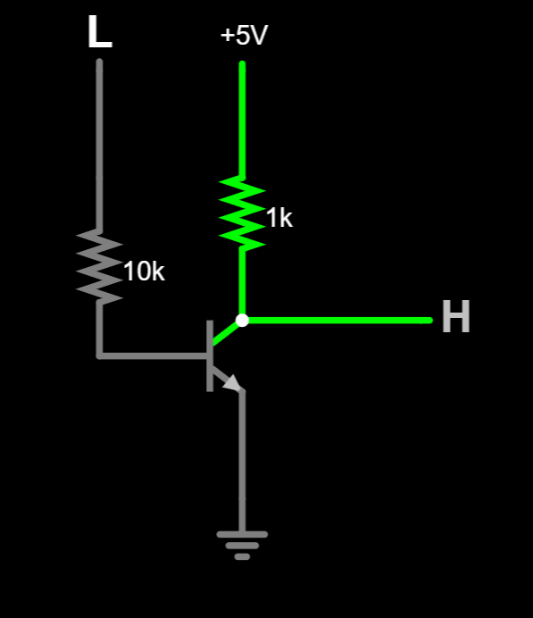
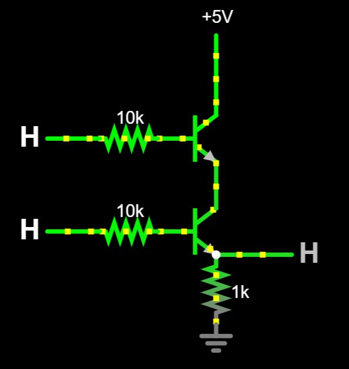
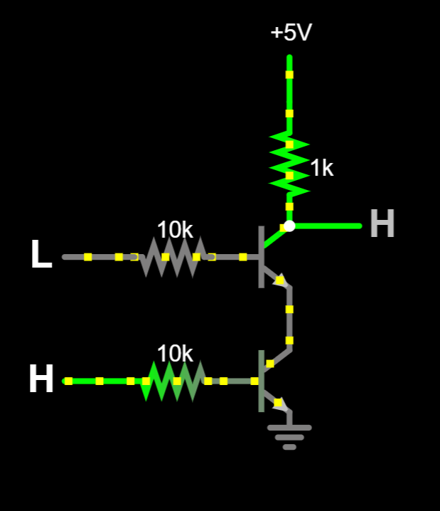
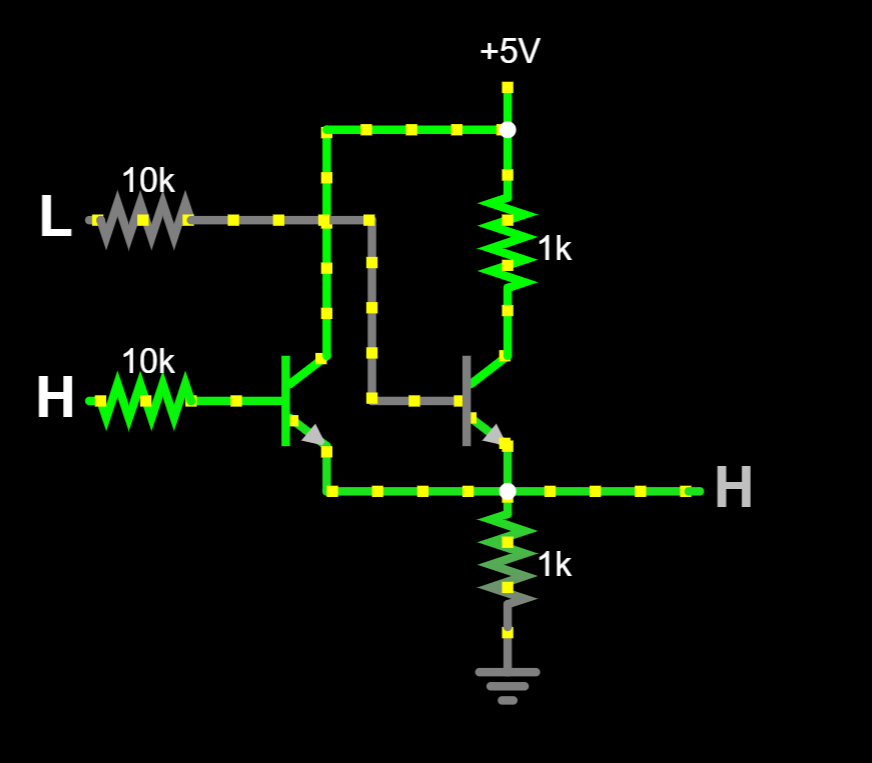
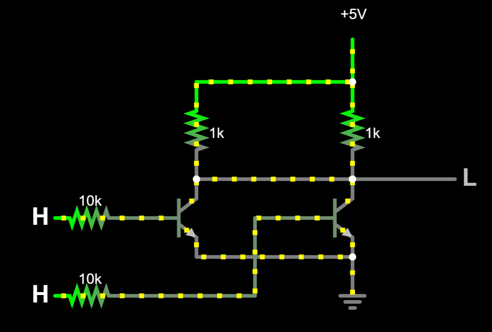

# Module 02 : Logic Gates / Gerbang Logika
>English Summary in the last section of page

## Tujuan
1. Mengetahui jenis-jenis gerbang logika dan keunikannya
2. Mengetahui tabel kebenaran pada tiap-tiap gerbang logika
3. Mengetahui susunan rangkaian elektris tiap gerbang logika dan drawbacknya
---
## Brief Theory
### Pengantar tentang logika boolean

### Penjelasan fungsi dasar masing-masing gerbang (AND, OR, NOT, dll) + simbol dan persamaannya

### Tabel kebenaran dari masing-masing gerbang

### Gambaran umum penggunaan di dunia nyata (contoh: komputer, saklar otomatis, sensor logika)

### Sedikit penjelasan pendekatan: IC Logic (misal 74xx series) Discrete logic pakai transistor (kalau kamu buat dari NPN juga)

---
## Tools and Materials
- Breadboard
- Kabel jumper
- Resistor (220Ω, 1kΩ, 10kΩ, dll)
- LED
- Push button
- Transistor NPN (misal 2N3904)
- Gunting/Cutter
- Tweezer

---
## Circuit Diagram

Disini, aku bakalan pakai aplikasi simulasi Falstad. Meskipun kurang nyata, simulasi ini sangatlah cukup bagi kebutuhanku dalam menjelaskan secara sederhana rangkaian dan hasil dari logic gates dasar.

NAMA | RANGKAIAN
-----|---
NOT |
AND |
NAND |
OR |
NOR |
XOR |
XNOR |
---
## Layout Breadboard
---
## Resulting Test
---
## Notes

---
---
# English Summary

## Objective

## Brief Theory

## Tools and Materials

## Circuit Diagram

## Layout Breadboard

## Resulting Test

## Notes

