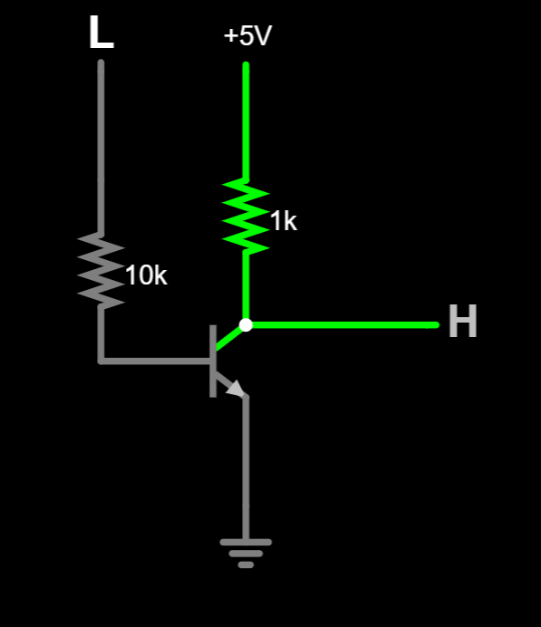
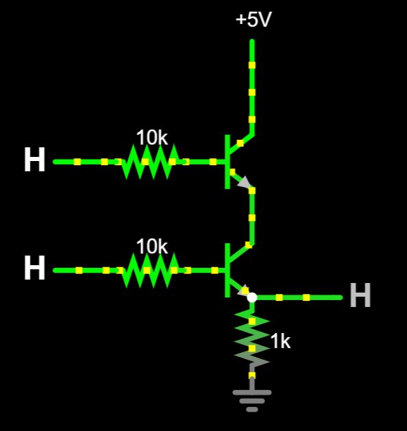
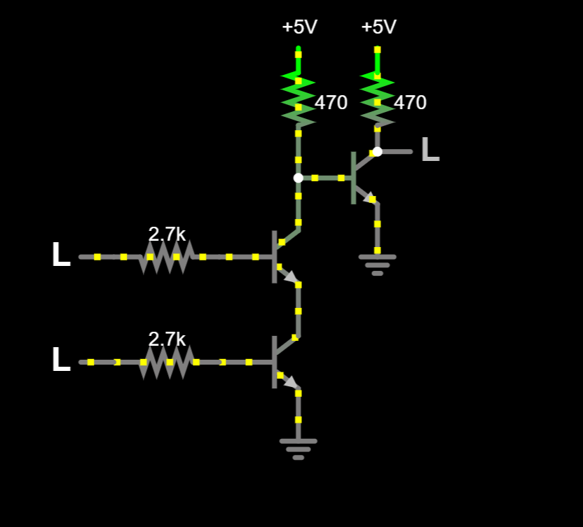
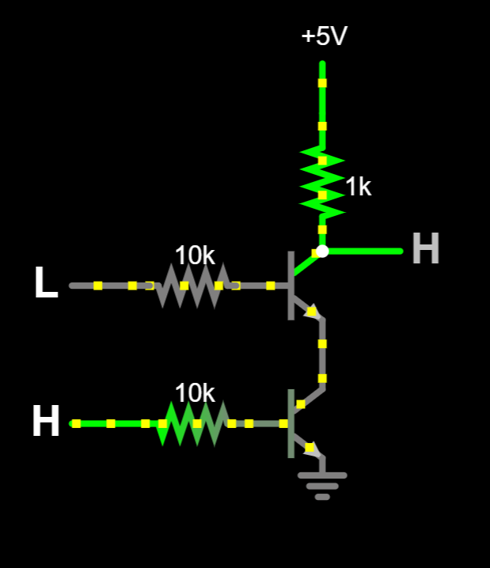
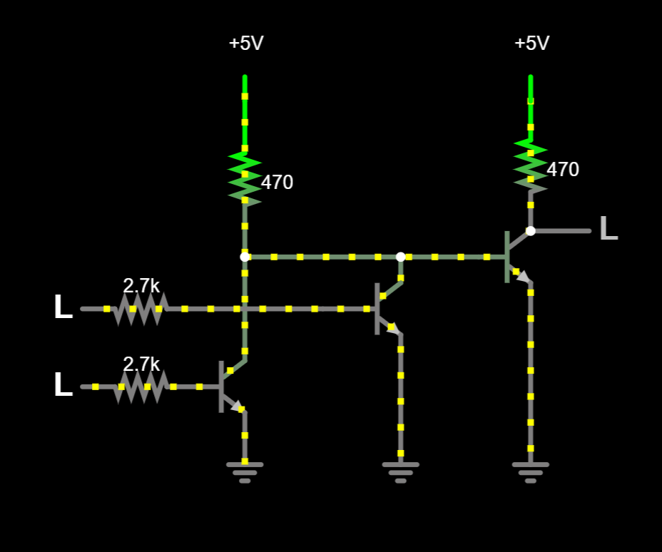
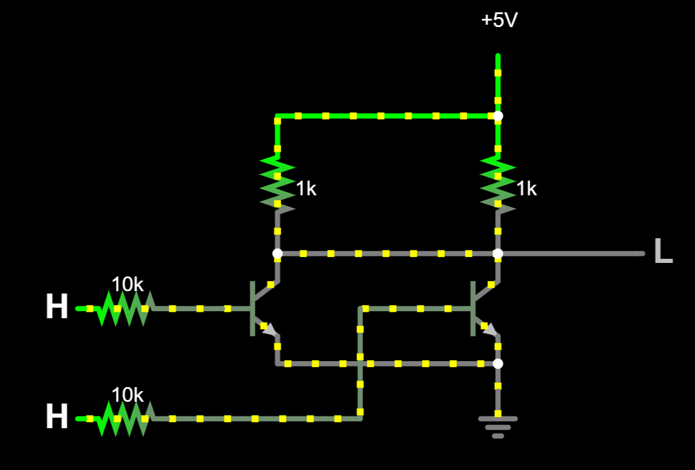
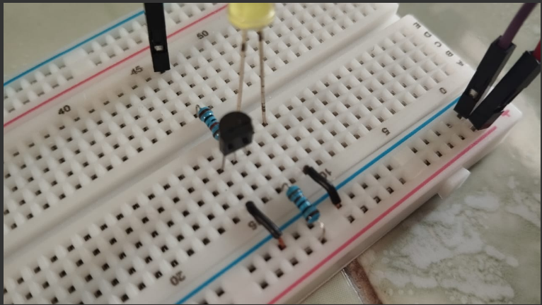
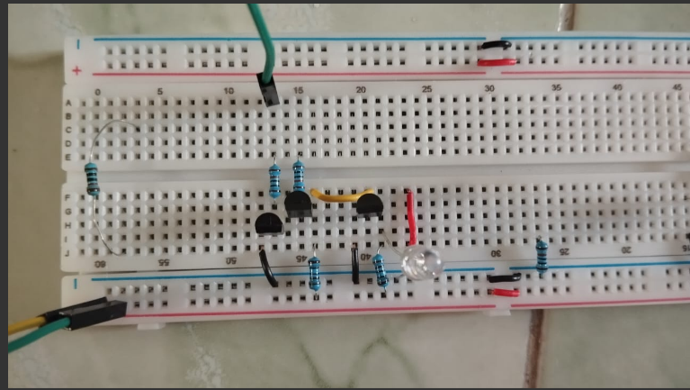
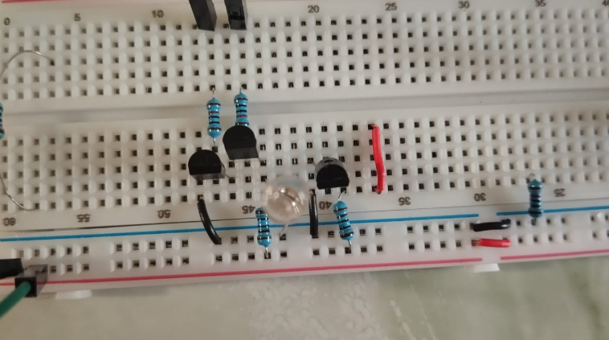
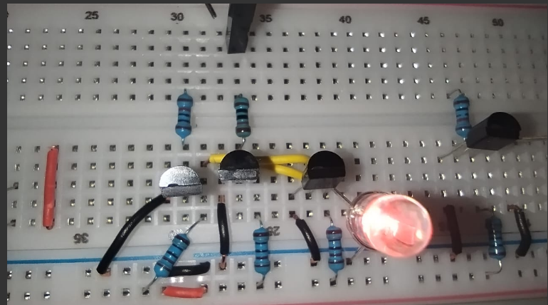

# Module 02 : Logic Gates / Gerbang Logika
>English Summary in the last section of page
>Note: This is my learning summary, so i'm not sure my summary is 100% correct. Do your own research :3
## Tujuan
1. Mengetahui jenis-jenis gerbang logika dan keunikannya
2. Mengetahui tabel kebenaran pada tiap-tiap gerbang logika
3. Mengetahui susunan rangkaian elektris tiap gerbang logika dan drawbacknya
---
## Brief Theory
[to the circuit diagram](#circuit)

### Pengantar tentang logika boolean
Logika boolean adalah seperangkat aturan logika yang **bekerja berdasar pada aturan aljabar boolean**. Logika ini bekerja dengan membagi kondisi-kondisi kebenaran **berdasarkan 2 state**, True/False, 1/0, High/Low, dan lain lain.

Logika boolean sangatlah penting dalam sistem digital karena rangkaian itu sendiri dibuat agar bekerja pada 2 kondisi yang terdefinisi, HIGH (3.3V,5V,dll) dan juga low (0V). Dengan aturan seperti ini pula, **rangkaian listrik akan lebih sederhana** dibandingkan ketika misalnya kita perlu mendefinisikan 10 state yang berbeda untuk merepresentasikan bilangan desimal/bilangan manusia langsung. 
Keuntungan lain dalam menerapkan logika boolean adalah **rangkaian yang cepat** dalam memproses perhitungan, **dapat diandalkan** karena minim error, maupun juga **konsisten**.
Untuk itu, kita memerlukan semacam definisi untuk mendeskripsikan keputusan-keputusan logika itu yang relatif mudah dicerna oleh manusia ke rangkaian-rangkaian listrik yang secara esensi tidak bisa berpikir. Untuk itulah kita memerlukan **gerbang logika** yang berperan sebagai unit terkecil dari sistem digital
> George Boole, pencetus logika boolean, membuat buku berjudul *An Investigation of the Laws of
Thought* yang berisikan tentang cara berpikir dan berlogika berdasarkan kondisi-kondisi alami yang terbagi menjadi dua kondisi (seperti mati dan hidup, on/off,dll)
#### Tabel Kebenaran
Tabel kebenaran adalah sebuah diagram/tabel yang menjelaskan **bagaimana sebuah operator logika ataupun rangkaian logika bekerja dan menghasilkan output berdasarkan input yang diberikan**. Sehingga tabel kebenaran berisi tentang seluruh kemungkinan-kemungkinan unik yang dihasilkan oleh sebuah sistem logika tertentu.   
A|B|x
-|-|-
0|0|1
0|1|1
1|0|1
1|1|0   
> Contoh tabel logika (NAND)

Jumlah dari baris tabel kebenaran ditentukan oleh jumlah input logikanya, jika ada 2 input, terdapat 4 baris. Jika ada 3 input, ada 8. Sehingga dapat kita simpulkan jumlah dari seluruh kemungkinan tabel kebenaran adalah 2N kemungkinan

---

### Gerbang Logika
#### 1. AND
Gerbang logika AND adalah gerbang logika yang nilai outputnya 1 **HANYA** ketika keseluruhan input bernilai 1

artinya kita membutuhkan nilai seluruh input itu bernilai benar agar nilai outputnya itu benar. Ini bisa kita bayangkan seperti ketika kita memakai konjungsi dan.
Ekspresi boolean dari gerbang ini adalah:
>x = A×B×....
#### 2. OR
Gerbang logika OR adlaah gerbang logika yang nilai outputnya 0 **HANYA** ketika keseluruhan input bernilai 0.

Ekspresi boolean dari gerbang OR adalah:
> x = A+B+....
#### 3. NOT
Not, atau biasa disebut dengan inverter (dalam elektro), adalah gerbang logika yang nilai outputnya **BERKEBALIKAN** dengan nilai inputnya. Operasi NOT juga bisa disebut dengan operasi negasi

Ekspresi boolean dari gerbang NOT adalah:
> x = Ā
> atau
> x = ~A
> atau
> x = ¬A
>yang esensinya adalah
> x = -1×A

##### Input dari gerbang logika
Gerbang-gerbang logika sebelumnya bekerja pada berbagai input yang diberikan. NOT, hanya bekerja pada 1 input. **OR dan AND, bisa bekerja pada 2 input atau lebih**. Secara rangkaian listrik, kita bisa mendapatkan gerbang AND/OR lebih dari 2 input dengan memasangkan output gerbang itu ke input gerbang yang lain.(combining logic gates).
</img>

#### Gerbang Logika Dasar
Gerbang logika dasar adalah gerbang yang memiliki kemampuan berdasarkan tabel kebenarannya untuk menghasilkan semua gerbang-gerbang logika yang lain. Gerbang logika tersebut adalah
AND, OR, dan NOT. Dengan gerbang itu, kita bisa membuat konsep gerbang lain, misalnya NAND diambil dari NOT dan AND, NOR dari NOT dan OR. dan lain sebagainya.

#### Gerbang Logika Universal
Sedangkan, gerbang logika universal, adalah gerbang logika yang **secara rangkaian listrik bisa digunakan untuk menyusun fungsi-fungsi gerbang lain** bahkan gerbang dasar sekalipun. Gerbang tersebut adalah NAND and NOR.
Hal ini disasarkan atas pertimbangan-pertimbangan berikut:
- lebih mudah direalisasikan dalam rangkaian/hardware
- Lebih hemat SDA dibandingkan menyusun dari konsep gerbang dasar langsung (CMOS technology)
- Lebih terstandarisasi dalam dunia industri
- Proses lebih cepat karena membutuhkan sedikit komponen
- Lebih hemat energi juga dariapda menyusun dari OR,AND,NOT
  
Contohnya adalah, gerbang NAND sendiri dapat digunakan untuk menyusun gerbang-gerbang logika lain seperti XOR,XNOR,dan bahkan gerbang dasar dengan lebih hemat sumber daya karena gerbang logika **NAND itu sendiri bisa didapatkan tanpa menyusun dari AND dan OR secara bersama2**.

Namun kita akan tetap melanjutkan pemahaman kita tentang konsep gerbang logika dasar yang bisa menyusun gerbang-gerbang lain. Dan dengan tetap menggunakan gerbang logika dasar, kita bisa **lebih mudah menyusunnya dalam bentuk matematis aljabar boolean**.

#### 4. NAND
Secara konsep adalah gabungan dari AND yang outptunya menuju NOT 

</img>

Dengan ekspresi booleannya adalah:
> x = A×B

#### 5. NOR
Secara konsep adalah output dari OR yang disambungkan ke NOT 

</img>

> x = A+B

#### Bubbled Gate
Lalu bagaimana jika kita menyambungkan NOT dulu baru kita akan hubungkan ke gerbang lain (AND/OR). hal ini akan menghasilkan apa yang dinamakan Bubbled Gate.
> 
Note

> sebenarnya aku masih bingung, apakah NAND juga termauk bubbled gate ataupun tidak, tapi untuk sekarang, saya mendefinisikan bubbled gate hanya berkaitan dengan <b>input saja</b>
>
</img>

Konsep bubbled gate sangat berguna saat kita ingin menyusun ekuivalensi-ekuivalensi hasil gerbang logika dengan susunan-susunan tertentu. Susunan-susunan tertentu ini bisa disebut dengan ***Alternative Gate***

#### Alternative Gate
*Alternatif gate* adalah gerbang yang memiliki tabel kebenaran yang sama dengan gerbang asli namun memiliki susunan logika yang berbeda. Kenapa gerbang ini ada karena alasan2 tertentu yang sebagain besar berkaitan dengan manufaktur.
Alasan:
1. Menyederhanakan desain sistem
2. Menyelaraskan input/sistem yang digunakan, apakah active-low/active-high
3. mempermudah implementasi fisik di dunia nyata
   
   </img>

#### 6. XOR
Atau bisa disebut dengan *exclusive or* adalah sama dengan logika atau yang berada dalam dunia nyata. 
ketika ada teman kita yang menawarkan minuman *"teh atau kopi"*, kita pasti disuruh memilih salah satunya dan kita akan memilih diantara keduanya (either). Tapi ketika kita malah menjawab *"keduanya aja"*, mungkin kita sudah ga dianggap teman lagi :v

Dengan ekspresi boolean XOR adalah:
>x=A⊕B
 atau
>x =  AB+ BA

#### 6. XNOR
Gerbang XNOR, OR yang dihubungkan ke NOT, yang keluaran akan bernilai benar ketika inputnya bernilai sama.

Dengan ekspresi boolean XOR adalah:
>x=A⊕B
 atau
 x=AB + A B

##### Kenapa menggunakan Exclusive gate
*Exclusive gate*, walaupun sulit untuk dilogik,sangatlah berguna dalam penyusunan sistem-sistem digital yang kompleks. X gates, berguna dalam penyusunan komponen digital seperti Adder, ALU, dll.

### Brief Summary

Selain itu juga, kita perlu belajar mengenai dasar-dasar dari aljabar boolean agar bisa menganalisis rangkaian gerbang logika sehingga kita bisa menyederhanakan rangkaian lebih lanjut dan mendapatkan efektivitas dan efisiensi yang tinggi. *Dan kita bisa juga mendapatkan pekerjaan :3*

### Application in the real life
Banyak lah, ngapain ditanyain

### IC and Discrete
Gerbang logika, dapat kita temui dalam bentuk discrete maupun IC (Integrated Circuit). Gerbang logika dalam bentuk discrete dapat kita temukan ataupun buat melalui komponen-komponen transistor (BJT maupun FET).
 Namun, kita sering melihat dalam bentuk BJT karena FET itu sendiri lebih sering ditemukan dalam bentuk IC karena lebih kompleks susunannya untuk membentuk logic gates dan mudah rusak

Gerbang logika dalam bentuk IC, dapat kita temukan dalam bentuk chip, sehingga IC logic gates biasanya lebih compact, murah, dan lebih lazim digunakan di zaman modern.

Untuk percobaan membuat logic gates, pastinya kita akan membuat dalam bentuk discrete dan menggunakan BJT sebagai transisornya.

---
## Tools and Materials
- Breadboard
- Kabel jumper
- Resistor (220Ω, 1kΩ, 10kΩ, dll)
- LED
- Push button
- Transistor NPN (misal 2N3904)
- Gunting/Cutter
- Tweezer

---
## Circuit Diagram 

Disini, aku bakalan pakai aplikasi simulasi Falstad. Meskipun kurang nyata, simulasi ini sangatlah cukup bagi kebutuhanku dalam menjelaskan secara sederhana rangkaian dan hasil dari logic gates dasar.

NAMA | RANGKAIAN
-----|---
NOT |
AND |
AND-new |
NAND |
OR |
OR New |
NOR |
XOR |
XNOR |
> Aku membuat beberapa desain dalam satu logic gates, dengan perbedaan lokasi output yang digunakan (ada yang dari collector, dan ada yang dari emiitter. Dan pada penerapannya umumnya pakai yang collector)

---
## Layout Breadboard
---

NAMA | RANGKAIAN
-----|---
NOT | 
AND |
NAND |
OR |
NOR |
XOR |
XNOR |

## Resulting Test
---
## Notes

 

---
---
# English Summary

## Objective

## Brief Theory

## Tools and Materials

## Circuit Diagram

## Layout Breadboard

## Resulting Test

## Notes

---
### Source
[BreadBoardCircuits.com : BJT Logic Gates](https://breadboardcircuits.com/bjt-logic-gates/)

[Creating Logic Gates using Transistors](https://www.101computing.net/creating-logic-gates-using-transistors/)

Digital systems: principles and applications, Ronald J. Tocci