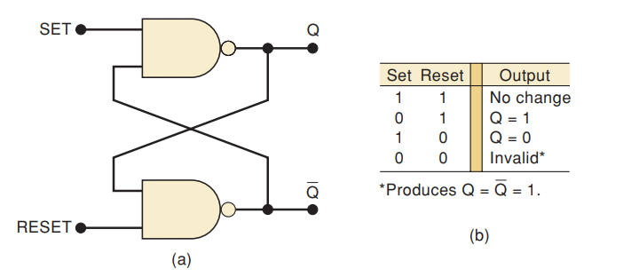
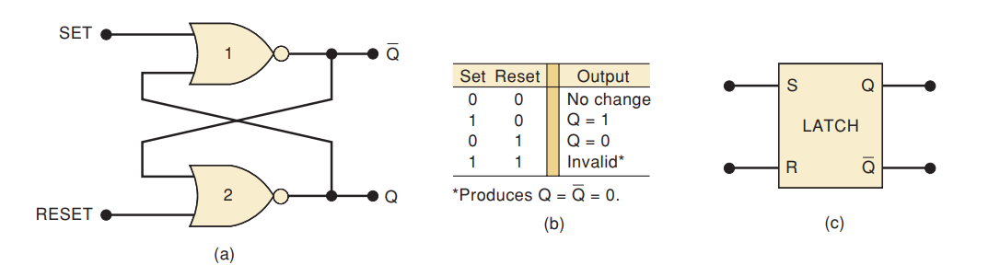

# Module 03 : Flip-Flops (FF's)
>English Summary in the last section of page

## Tujuan
- Mengetahui jenis-jenis flip-flop dan susunan transistornya
- Memahami tabel kebenaran tiap-tiap FF's
- Memahami penerapan praktis di dunia sehari-hari

## Brief Theory
#### Apa itu Flip-Flop
Flip-flop adalah salah satu rangkaian elektronik yang **memiliki 2 kondisi output yang stabil.** FliP-Flop (FF's) merupakan susunan terkecil rangkaian sistem digital yang dapat penyimpanan nilai-nilai 2 kondisi/biner. Karena itulah, flip-flop sangat berperan dalam penyusunan sistem yang sangat kompleks seperti register, counter, encoder, maupun multipexer . Dan dengan susunan unit-unit itu, kita bisa menggunakan komputer yang sangat membantu membangun peradaban manusia.
Flip-flop sangatlah berguna dalam perkembangan komputer karena dengan adanya rangkaian FF's, kita **bisa menyimpan informasi/ nilai digit** tertentu dengan menggunakan karakteristik FF's tersebut
#### Kombinasi vs Sekuensial
Rangkaian kombinasi adalah rangkaian yang dimana hasil **outputnya dipengaruhi oleh kondisi inputnya secara langsung**. Contohnya adalah gerbang-gerbang logika yang outputnya itu sangatlah dipengaruhi oleh input-inputnya. Selanjutnya, nilai-nilai input sebelumnya tidak memiliki efek apapun pada output saat ini

Sedangkan, rangkaian sekuensial memiliki karakteristik bahwa hasil **outputnya itu dipengaruhi baik output sekarang maupun kondisi output-output sebelumnya**. Rangkaian sekuensial memiliki bagian rangkaian kombinasi (susunan logic gates) dan komponen memory, sehingga pada level kali ini, "benda mati" bisa memiliki kemampuan mengingat informasi

Flip-flop itu sendiri, adalah salah satu contoh dari rangkaian sekuensial. Flip-flop, yang tersusun dari beberapa pasang logic gates, dapat mengingat informasi atau ***melatching*** nilai output sekarang meskipun inputnya berubah. 
Nama kata *flip-flop* itu sendiri juga berasal dari kemampuan FF's itu sendiri yang dapat memiliki 2 nilai stabil yang terus berganti, HIGH and LOW.
#### Latch
Jika kita menyusun 2 gerbang logika yang sama (NOR atau NAND), kita bisa mendapatkan rangkaian sekuensial atau rangkaian yang bisa ***mengingat***

##### NAND LATCH

##### NOR LATCH

Untuk gambar komponen itu sendiri, antar NAND dan NOR tetaplah sama

#### Flip-Flop vs Latch
Intinya yang bisa aku sebutkan adalah, Latch itu lebih dasar atau sederhana karena dia tidak memiliki input clocked. Namun Flip-Flop lebih presisi karena terdapat clocked sehingga flip-flop hanya "bekerja" ketika terdapat perubahan nilai/transisi clocked

Latch|Flip-Flop
--|--
"UnClocked"|Clocked
Level-Triggered|Edge-Triggered

### Jenis-Jenis Flip-Flop
#### 1. SR
#### 2. JK
#### 3. T
#### 4. D
### Kegunaan
### Timing

## Tools and Materials
1. Breadboard
2. Kabel jumper / Solid Cable 0.6 mm
3. Transistor NPN
4. LED
5. Resistor
6. Capacitor
7. Push button (untuk input S/R/Clock)
8. Power supply (5V DC)

## Circuit Diagram

## Layout Breadboard

## Resulting Test

## Notes

---
# English Summary

## Objective

## Brief Theory

## Tools and Materials

## Circuit Diagram

## Layout Breadboard

## Resulting Test

## Notes

