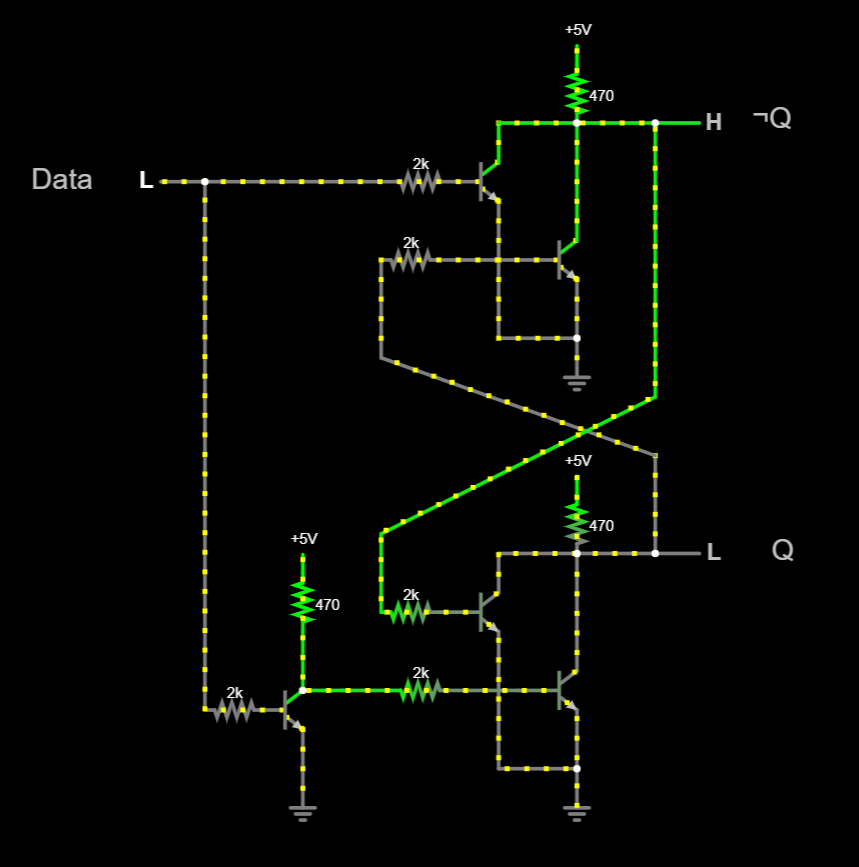

# Module 03 : Flip-Flops (FF's)
>English Summary in the last section of page

## Tujuan
- Mengetahui jenis-jenis flip-flop dan susunan transistornya
- Memahami tabel kebenaran tiap-tiap FF's
- Memahami penerapan praktis di dunia sehari-hari

## Brief Theory
#### Apa itu Flip-Flop
Flip-flop adalah salah satu rangkaian elektronik yang **memiliki 2 kondisi output yang stabil.** FliP-Flop (FF's) merupakan susunan terkecil rangkaian sistem digital yang dapat penyimpanan nilai-nilai 2 kondisi/biner. Karena itulah, flip-flop sangat berperan dalam penyusunan sistem yang sangat kompleks seperti register, counter, encoder, maupun multipexer . Dan dengan susunan unit-unit itu, kita bisa menggunakan komputer yang sangat membantu membangun peradaban manusia.
Flip-flop sangatlah berguna dalam perkembangan komputer karena dengan adanya rangkaian FF's, kita **bisa menyimpan informasi/ nilai digit** tertentu dengan menggunakan karakteristik FF's tersebut
#### Kombinasi vs Sekuensial
Rangkaian kombinasi adalah rangkaian yang dimana hasil **outputnya dipengaruhi oleh kondisi inputnya secara langsung**. Contohnya adalah gerbang-gerbang logika yang outputnya itu sangatlah dipengaruhi oleh input-inputnya. Selanjutnya, nilai-nilai input sebelumnya tidak memiliki efek apapun pada output saat ini

Sedangkan, rangkaian sekuensial memiliki karakteristik bahwa hasil **outputnya itu dipengaruhi baik output sekarang maupun kondisi output-output sebelumnya**. Rangkaian sekuensial memiliki bagian rangkaian kombinasi (susunan logic gates) dan komponen memory, sehingga pada level kali ini, "benda mati" bisa memiliki kemampuan mengingat informasi

Flip-flop itu sendiri, adalah salah satu contoh dari rangkaian sekuensial. Flip-flop, yang tersusun dari beberapa pasang logic gates, dapat mengingat informasi atau ***melatching*** nilai output sekarang meskipun inputnya berubah. 
Nama kata *flip-flop* itu sendiri juga berasal dari kemampuan FF's itu sendiri yang dapat memiliki 2 nilai stabil yang terus berganti, HIGH and LOW.
#### Latch
Jika kita menyusun 2 gerbang logika yang sama (NOR atau NAND), kita bisa mendapatkan rangkaian sekuensial atau rangkaian yang bisa ***mengingat***

##### NAND LATCH

##### NOR LATCH

Untuk gambar simplifikasi komponen itu sendiri, antar NAND dan NOR tetaplah sama, dan latch ini disebut dengan **SR LATCH**

##### D LATCH

Jika kita memiliki input SR yang saling berkebalikan (negasi), kita akan mendapatkan jenis latch baru yaitu adalah D latch (Data latch) yang intinya nilai dari output (Q) akan sama dengan nilai input D.

#### Flip-Flop vs Latch

Intinya yang bisa aku sebutkan adalah, Latch itu lebih dasar atau sederhana karena dia tidak memiliki input clocked. Namun Flip-Flop lebih presisi karena terdapat clocked sehingga flip-flop hanya "bekerja" ketika terdapat perubahan nilai/transisi clocked

Latch|Flip-Flop
--|--
"UnClocked"|Clocked
Level-Triggered|Edge-Triggered

### Jenis-Jenis Flip-Flop
#### 1. SR

SR flip-flop memiliki nilai Output berdasarkan kombinasi input S dan R (Set dan Reset). Ketika **Set** diaktifkan (ntah itu *active-low* atau *active-high*), nilai output akan bernilai *high*. Sebaliknya, ketika **Reset** diaktifkan, nilai output akan bernilai *Low* .
Namun, ketika S dan R diaktifkan secara bersama-sama, nilainya akan invalid/ambigu (tidak tentu).

##### What is Clock?

**Clock**, yang bisa disebut juga sebagai salah satu input dari flip-flop, adalah input yang digunakan untuk mengatur kapan input lain (S dan R misalnya) *dibaca* (***Enabling Input***).
Artinya, ketika clock itu aktif, nilai dari S dan R akan dibaca dan akan memengaruhi hasil outputnya. Dan ketika clock tidak aktif, **perubahan-perubahan pada nilai S dan R tidak akan diperhatikan** sampai nilai clock aktif kembali.
Clock, merupakan input yang aktif ketika ada transisi nilai (***Edge-triggered***). Artinya, clock akan bernilai aktif ketika nilai dari clock berubah dari LOW ke HIGH atau juga sebaliknya. Clock yang berubah ketika LOW ke HIGH disebut dengan PGT (Positive Going Transition) dan HIGH ke LOW disebut dengan NGT (Negative Going Transition).

</img>

Dan diatas adalah contoh dari penggunaan input clock dalam latch SR. Sehingga yang awalnya rangkaian tersebut adalah rangkaian latch, berubah menjadi rangkaian Flip-Flop / Clocked Flip-Flop.
</img>

Dan rangkaian diatas adalah penerapan atau cara mendapatkan input clock yang memiliki karakteristik ***Edge-Triggered***, baik itu PGT atau NGT.

#### 2. JK

Berbeda dengan SR FF's, Ketika kedua nilai input bernilai aktif (J dan K), flip-flop tidak akan menghasilkan nilai yang ambigu. Namun, JK FF's akan menghasilkan nilai **output yang berbeda dengan nilai output sebelumnya (toggle)**. Artinya, nilai output akan terbalik/inverted ketika nilai J dan K sama-sama aktif.
Selain itu, nilai-nilai di JK Flip-flop akan sama dengan SR FF's.

Tabel kebenaran JK FF's dapat kita hasilkan dengan memberikan koneksi *feedback* dari output ke input awal.

Jadi, yang awalanya FF's tersebut adalah SR, bisa menjadi JK ketiak kita menyambungkan nilai output ke input *steering clock*.

#### 3. T

Sedangkan, T FF's, atau bisa kita sebut dengan **Toggle Flip-flops**, akan memberikan nilai output yang berbeda dari nilai sebelumnya ketika T flip-flop diaktifkan. Dan T FF's akan memberikan nilai output yang sama dengan nilai sebelumnya ketika T FF's tidak diaktifkan.
> Bisa kita lihat di diagram diatas, bahwa T FF's itu memiliki 1 input saja

#### 4. D

Hampir sama dengan T FF's, namun kali ini, satu input tersebut akan saling menegasikan dan hasil outputnya akan memiliki nilai yang sesuai dengan inputnya secara langsung. 

Walau memang D FF's itu seperti tidak berguna (karena nilai input akan sama dengan nilai output secara langsung, sehingga berkehendak seperti kabel biasa), namun, D flip-flop sangat berperan dalam sebagian besar operasi komputer. D flip-flop (berasal dari kata Data), **hanya akan aktif atau membaca nilai input ketika waktu-waktu tertentu**, dalam hal ini ketika input clock aktif. Sehingga, D flip-flop sangat berguna ketika digunakan dalam operasi transfer data.

### Kegunaan

Terdapat banyak kegunaan flip-flop dalam sistem digital kita, terutama dalam hal penyimpanan suatu informasi dan transfer data.
Yang pertama, Flip-flop (D flip-flop) berfungsi dalam transfer data paralel.

 </img>

Sehingga, data hanya akan tersebar/ditransfer ketika nilai clocked/transfer aktif.
Kegunaan FF's selanjutnya adalah sebagai penyimpan suatu data. Sekumpulan FF's yang digunakan untuk menyimpan data disebut dengan **register**. Selanjutnya, data tersebut kerap digunakan dalam operasi transfer antar register/flip-flop.

Selain digunakan dalam transfer paralel, FF's juga digunakan dalam transfer serial, atau bisa disebut juga dengan ***Shift-Registers***. Disebut dengan demikian karena data dari register satu, akan bergeser ke register lain. Lebih lanjut, *Shift-Register* ini juga bisa digunakan dalam operasi *paralel data transfer* dengan cara tertentu.
</img>
</img>

Dan lebih banyak lagi kegunaan FF's seperti debouncing button, *frequency division*, counter, dan lain sebagainya.

### Timing

## Tools and Materials

1. Breadboard
2. Kabel jumper / Solid Cable 0.6 mm
3. Transistor NPN
4. LED
5. Resistor
6. Capacitor
7. Push button (untuk input S/R/Clock)
8. Power supply (5V DC)

## Circuit Diagram

NAMA | DIAGRAM | NOTES
-|-|-
SR NOR Latch   |||
SR NAND Latch  |||
D Latch        ||Not quite useful, just like an "wire"|
D Latch Enabled|||
SR with Enable |||
Clock Generator|||
SR|||
JK|||
T|||
D|||

## Layout Breadboard

## Resulting Test

## Notes

---

# English Summary

## Objective

## Brief Theory

## Tools and Materials

## Circuit Diagram

## Layout Breadboard
 
## Resulting Test

## Notes

---
## Source

[Electronic for U : Flip-Flops in Digital Electronics – Types, Truth Table, Circuit, and Uses](https://www.electronicsforu.com/technology-trends/learn-electronics/flip-flop-rs-jk-t-d)

